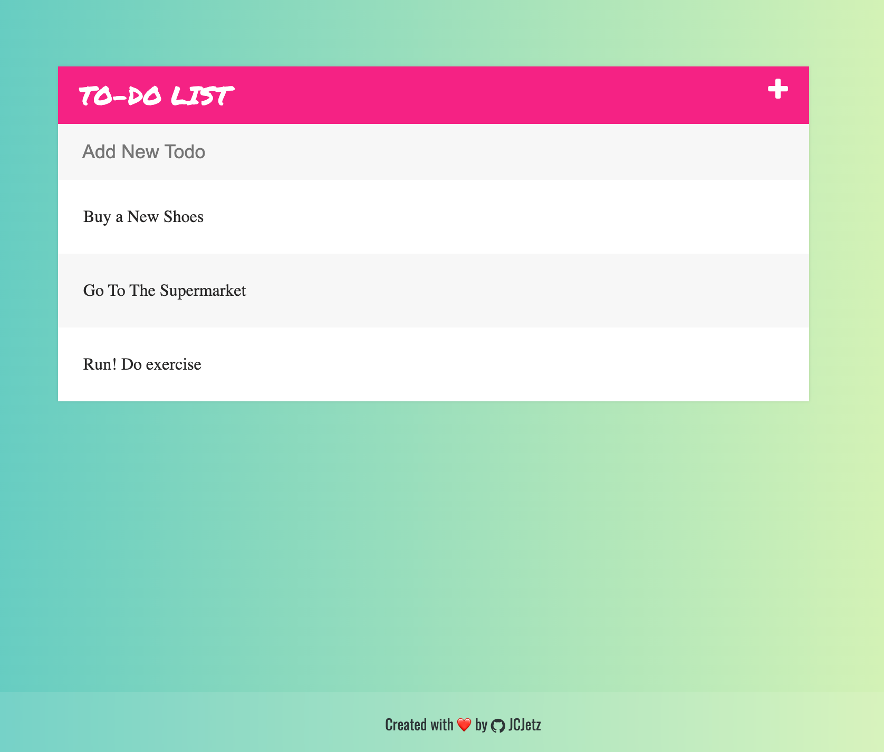

## 📝 Go To Do App
This repository contains a To-Do List application Challenge made with HTML, CSS & JavaScript.

## ✨ Características

- ✅ Añadir nuevas tareas
- 🗑️ Eliminar tareas con animación de desvanecimiento
- ✔️ Marcar tareas como completadas
- 🔄 Toggle del campo de entrada
- 💫 Animaciones suaves
- 📱 Diseño responsivo

## 🛠️ Tecnologías Utilizadas

- HTML5
- CSS3
- JavaScript
- jQuery
- Font Awesome (para iconos)

## 🚀 Cómo Usar

1. Haz clic en el icono '+' para mostrar/ocultar el campo de entrada
2. Escribe tu tarea y presiona Enter para añadirla
3. Haz clic en una tarea para marcarla como completada
4. Pasa el cursor sobre una tarea y haz clic en el icono de papelera para eliminarla

